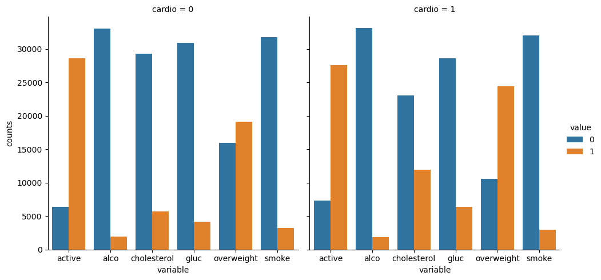
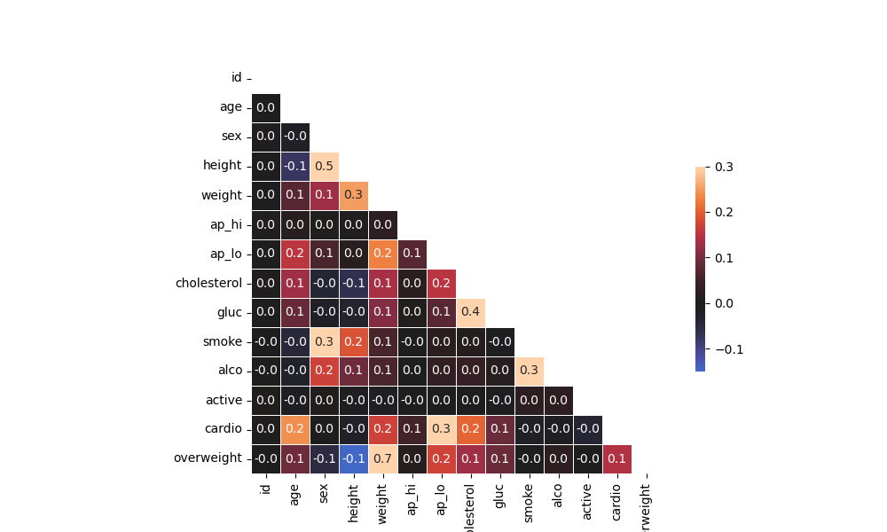

# Data Analysis with Python – freeCodeCamp Certification

This repository contains five projects completed for the **Data Analysis with Python** certification offered by [freeCodeCamp](https://www.freecodecamp.org/). Each project demonstrates core data analysis concepts using Python and scientific libraries like NumPy and Pandas.

## Table of Contents
- [Mean-Variance-Standard Deviation Calculator](#1. Mean-Variance-Standard Deviation Calculator)
- [Demographic Data Analyzer](#2-demographic-data-analyzer)
- [Medical Data Visualizer](#3-medical-data-visualizer)
- [Page View Time Series Visualizer](#4-page-view-time-series-visualizer)
- [Sea Level Predictor](#5-sea-level-predictor)

---

## 📂 Projects

### ✅ 1. Mean-Variance-Standard Deviation Calculator
[View notebook](./mean_var_std_calculator/mean-variance-standard%20deviation%20calculator.ipynb)  
Computes statistical measures (mean, variance, standard deviation, min, max, and sum) for rows, columns, and the entire 3×3 matrix using NumPy.

### ✅ 2. Demographic Data Analyzer
[View notebook](./demographic_data_analyzer/demographic-data-analyzer.ipynb)  
Analyzes demographic data to compute summary statistics and identify patterns across different groups, such as average age, education levels, and income brackets.

### ✅ 3. Medical Data Visualizer  
[View notebook](./medical_data_visualizer/medical-data-visualizer.ipynb)  
Processes clinical examination data to compute and visualize health indicators. Includes BMI-based overweight classification, binary normalization of cholesterol and glucose levels, and visual summaries using categorical plots and correlation heatmaps.

### ✅ 4. Page View Time Series Visualizer  
[View notebook](./page_view_time_series_visualizer/page-view-time-series-visualizer.ipynb)  
Analyzes freeCodeCamp forum page view data between May 2016 and December 2019. Cleans the dataset by removing statistical outliers, then visualizes long-term and seasonal trends using a line chart, a grouped bar chart, and dual box plots showing yearly and monthly distributions.

### ✅ 5. Sea Level Predictor  
[View notebook](./sea_level_predictor/sea-level-predictor.ipynb)  
Analyzes global sea level data from 1880 to 2013 and predicts future trends through linear regression. Includes two lines of best fit: one based on all available historical data, and one starting from the year 2000 to capture more recent changes. Visualizes both projections up to the year 2050 using `matplotlib` and `scipy`.

---

## 🛠️ Tools Used
- Python 3
- NumPy
- Pandas
- Matplotlib
- Jupyter Notebook

---

**Author:** Elisabeth Loiperdinger  
🧪 Built with curiosity and precision during the 2024 freeCodeCamp course.
